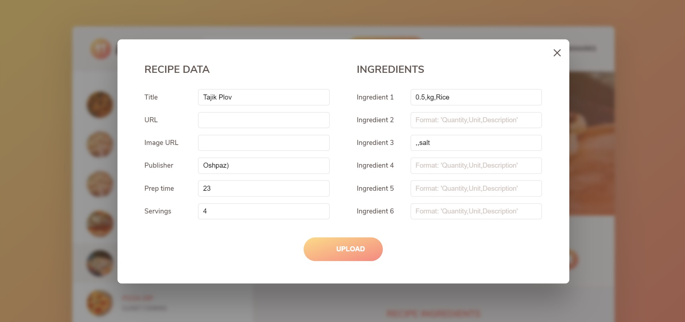

# Forkify App
> forkify app is one of the projects done as part of the  course - [The Complete JavaScript Course 2021: From Zero to Expert!](https://www.udemy.com/course/the-complete-javascript-course/)

run using the following command:
```
npm init
npm i
npm start / npm build
```
# Tools Used
*HTML5/CSS3, JS (DOM Manipulation, MVC...)* 

```sh
git clone https://github.com/Maverick2502/forkify-app.git
```


